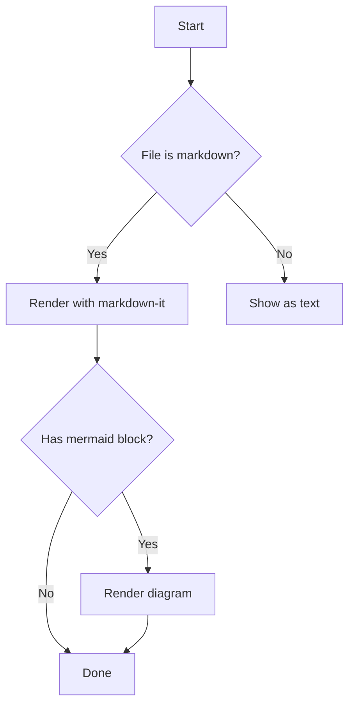
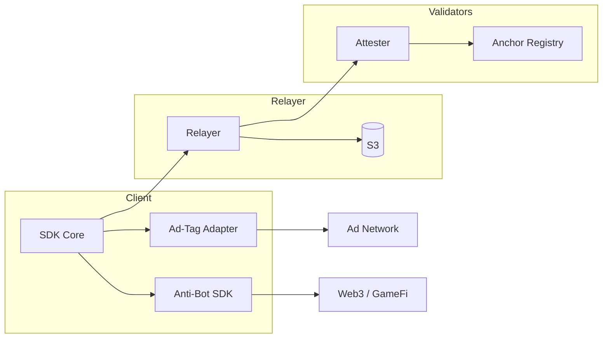
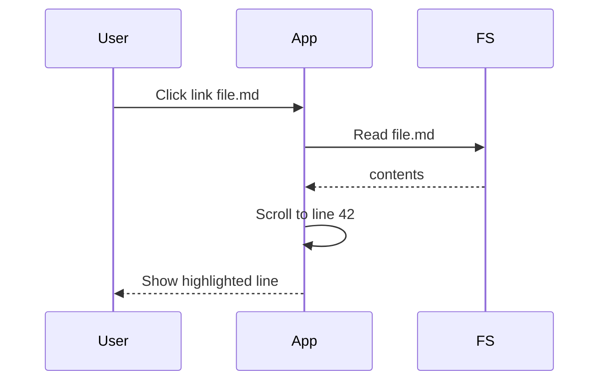

# Sample Document

Welcome to the **Markdown Viewer** test document.

## Navigation tests

- Jump to [the second document, line 12](second.md#L12)
- Jump to [`QA` phần 3](second.md#3-ad-tag--anti-bot-phase-1) (anchor with `&` / parens)
- Jump to [a heading in the second doc](second.md#section-two)
- Jump to a [local heading](#long-section) in this file
- An [external link](https://example.com) (opens in your browser)
- A [missing file link](does-not-exist.md) (shows a toast)

## Long section

Scroll down — then use **Back** to return to exactly where you were.

| Feature | Status |
| --- | --- |
| Open file/folder | ✅ |
| Line anchors | ✅ |
| Back / Forward | ✅ |

```js
function hello() {
  console.log("syntax block renders");
}
```

> Blockquotes, tables, and code all render.

## Flowchart (Mermaid)



A diagram with subgraphs (tests cluster spacing):



A sequence diagram also works:



Line filler to make scrolling meaningful:

1. one
2. two
3. three
4. four
5. five
6. six
7. seven
8. eight
9. nine
10. ten

Done. Try clicking the links above.
